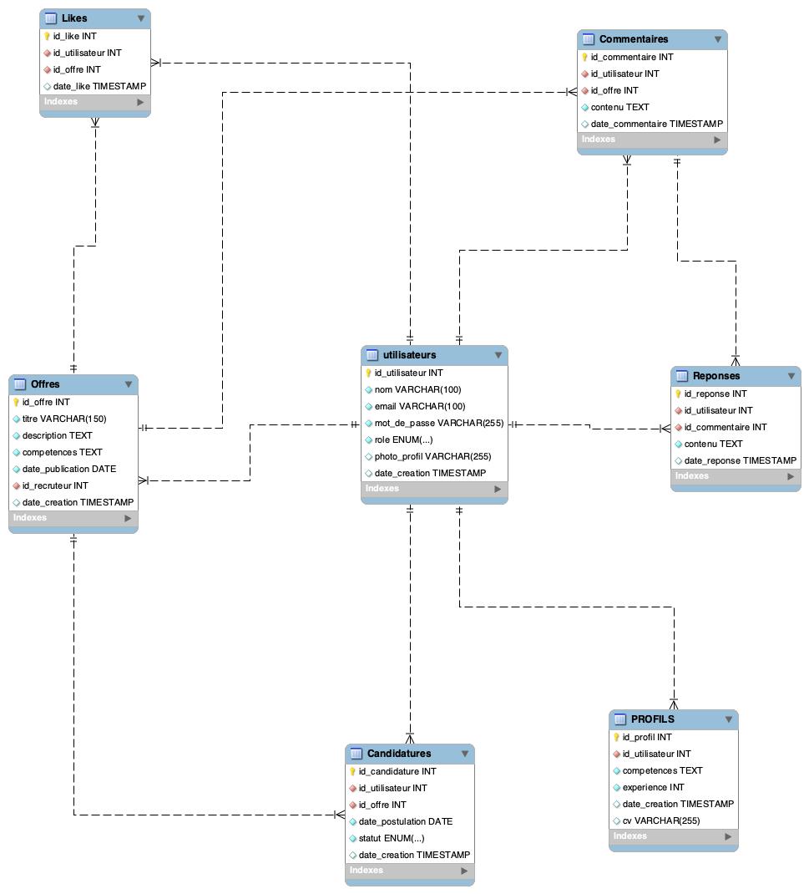

# Plateforme de Recherche d'Emploi avec Suggestions Personnalisées et Fonctionnalités Sociales (XJOBX)

## 1. Introduction

### 1.1 Contexte
Le marché de l'emploi est de plus en plus concurrentiel. Les chercheurs d'emploi et les recruteurs peinent souvent à se connecter efficacement. Ce projet propose une plateforme innovante intégrant des recommandations personnalisées et des fonctionnalités sociales permettant aux utilisateurs de postuler et liker des offres d'emploi. L'objectif est de simplifier l'accès aux opportunités tout en améliorant l'interactivité de la plateforme.

### 1.2 Objectifs généraux
- Offrir un outil performant pour chercheurs d'emploi et recruteurs
- Automatiser la suggestion d'offres d'emploi basées sur le profil utilisateur
- Faciliter le processus de recrutement
- Permettre aux utilisateurs de postuler, liker et enregistrer des offres

## 2. Description du projet

### 2.1 Objectifs fonctionnels
1. Permettre aux chercheurs d'emploi de créer un profil détaillé avec leurs compétences et expériences
2. Proposer des offres d'emploi pertinentes grâce à un moteur de recommandation
3. Permettre aux recruteurs de publier des offres et de consulter des profils adaptés
4. Offrir une interface simple, intuitive et accessible
5. Ajouter des fonctionnalités sociales telles que la possibilité de postuler, liker et enregistrer des offres d'emploi

### 2.2 Objectifs non fonctionnels
- **Performance** : Réponse rapide pour les suggestions
- **Sécurité** : Protection des données personnelles
- **Scalabilité** : Support d'un grand nombre d'utilisateurs et d'offres

## 3. Fonctionnalités principales

### 3.1 Fonctionnalités pour les chercheurs d'emploi
- Création de profil avec compétences, expériences et CV téléchargeable
- Suggestions automatiques d'offres d'emploi selon les compétences
- Recherche avancée avec filtres (localisation, secteur, type de contrat)
- Historique des candidatures et suivi du statut
- Possibilité de liker et enregistrer des offres

### 3.2 Fonctionnalités pour les recruteurs
- Création de compte recruteur
- Publication d'offres d'emploi avec titre, description, localisation et compétences requises
- Consultation des profils et des candidatures reçues
- Visualisation des offres populaires via les likes

### 3.3 Moteur de suggestion (Data Science)
- Extraction des compétences des CV et des descriptions d’offres
- Calcul de similarité entre compétences et offres avec **TF-IDF** et **Cosine Similarity**
- Score de pertinence pour chaque suggestion d'offre

## 4. Architecture technique

### 4.1 Technologies utilisées
- **Backend** : J2EE avec Servlets, JSP
- **Frontend** : JSP, HTML5, CSS3, JavaScript
- **Base de données** : MySQL
- **Data Science** : Python avec SpaCy, Scikit-learn, Pandas
- **Serveur** : Apache Tomcat

### 4.2 Schéma de l’architecture
- **Frontend** ↔ **API REST (J2EE)** ↔ **Base de données (MySQL)**
- **Scripts Python** pour les algorithmes de suggestion appelés depuis le backend

## 5. Modèle de base de données

### 5.1 Tables principales
- **Utilisateurs** : Gestion des chercheurs d’emploi et recruteurs
- **Profils** : Détails du profil utilisateur (compétences, expérience)
- **Offres** : Détails des offres d'emploi
- **Candidatures** : Suivi des candidatures des utilisateurs
- **Likes** : Enregistrement des likes des utilisateurs sur les offres

## 6. Conception des algorithmes

### 6.1 Extraction de texte
- Extraction des compétences avec **SpaCy** (tokenization, lemmatization)

### 6.2 Calcul de similarité
- Modèle **TF-IDF** pour pondérer les compétences
- Calcul de **Cosine Similarity** pour mesurer la pertinence entre profils et offres

## 7. Base de données (SQL)

### 7.1 Tables principales

```sql
CREATE TABLE Utilisateurs (
    id_utilisateur INT AUTO_INCREMENT PRIMARY KEY,
    nom VARCHAR(100) NOT NULL,
    email VARCHAR(100) NOT NULL UNIQUE,
    mot_de_passe VARCHAR(255) NOT NULL,
    role ENUM('chercheur_emploi', 'recruteur') NOT NULL,
    photo_profil VARCHAR(255) DEFAULT NULL,
    date_creation TIMESTAMP DEFAULT CURRENT_TIMESTAMP
);

CREATE TABLE Profils (
    id_profil INT AUTO_INCREMENT PRIMARY KEY,
    id_utilisateur INT NOT NULL,
    competences TEXT NOT NULL,
    experience INT NOT NULL,
    FOREIGN KEY (id_utilisateur) REFERENCES Utilisateurs(id_utilisateur) ON DELETE CASCADE,
    date_creation TIMESTAMP DEFAULT CURRENT_TIMESTAMP
);

CREATE TABLE Offres (
    id_offre INT AUTO_INCREMENT PRIMARY KEY,
    titre VARCHAR(150) NOT NULL,
    description TEXT NOT NULL,
    competences TEXT NOT NULL,
    date_publication DATE NOT NULL,
    id_recruteur INT NOT NULL,
    FOREIGN KEY (id_recruteur) REFERENCES Utilisateurs(id_utilisateur) ON DELETE CASCADE,
    date_creation TIMESTAMP DEFAULT CURRENT_TIMESTAMP
);

CREATE TABLE Candidatures (
    id_candidature INT AUTO_INCREMENT PRIMARY KEY,
    id_utilisateur INT NOT NULL,
    id_offre INT NOT NULL,
    date_postulation DATE NOT NULL,
    statut ENUM('en_attente', 'acceptée', 'rejetée') NOT NULL DEFAULT 'en_attente',
    FOREIGN KEY (id_utilisateur) REFERENCES Utilisateurs(id_utilisateur) ON DELETE CASCADE,
    FOREIGN KEY (id_offre) REFERENCES Offres(id_offre) ON DELETE CASCADE,
    date_creation TIMESTAMP DEFAULT CURRENT_TIMESTAMP
);

CREATE TABLE Likes (
    id_like INT AUTO_INCREMENT PRIMARY KEY,
    id_utilisateur INT NOT NULL,
    id_offre INT NOT NULL,
    date_like TIMESTAMP DEFAULT CURRENT_TIMESTAMP,
    FOREIGN KEY (id_utilisateur) REFERENCES Utilisateurs(id_utilisateur) ON DELETE CASCADE,
    FOREIGN KEY (id_offre) REFERENCES Offres(id_offre) ON DELETE CASCADE
);
```

### 7.2 Index pour optimisation
```sql
CREATE INDEX idx_utilisateur ON Candidatures(id_utilisateur);
CREATE INDEX idx_offre ON Candidatures(id_offre);
CREATE INDEX idx_offre_like ON Likes(id_offre);
```

---

Ce projet vise à améliorer l'expérience de recherche d'emploi et de recrutement grâce à une plateforme intuitive et intelligente.

